# MONGODB

## Tools

1. MongoDB Shell - CLI
2. MongoDB Compass - GUI

### Using Mongo

```bash
mongosh
```

### Collections and Documents

1. Collections are like tables
2. Collections have Documents

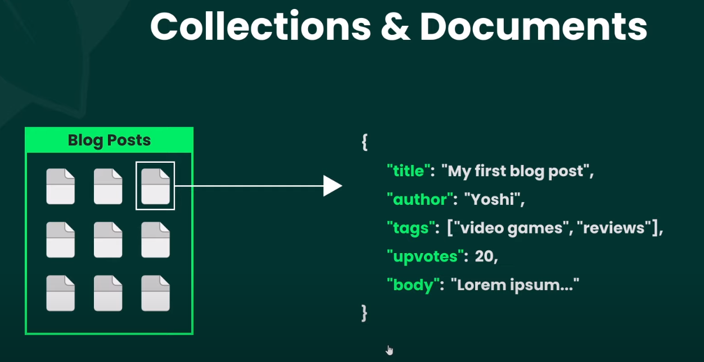

Notes:
    - data are stored similar to JSON
    - BSON - Binary JSON
    - `_id` 
        - every Document has a unique id (internally generated)
        - assigned by MongoDB itself
        - type: `ObjectId`
    - document itself can have a property that is a document or an array of document
        - it is called a nested document

### MongoDB Compass

1. Click Connect in New Connection
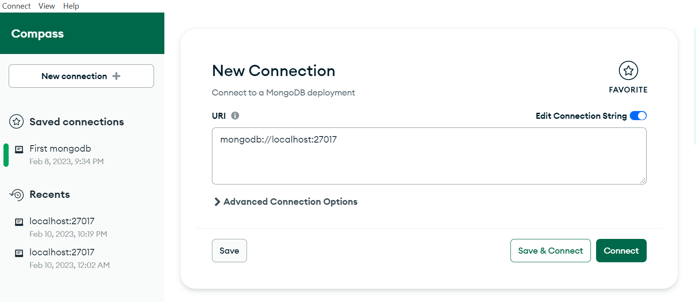

2. Go to services and make sure MongoDB Server is up and running
    - MongoDB Compass wont work if MongoDB Server service is down
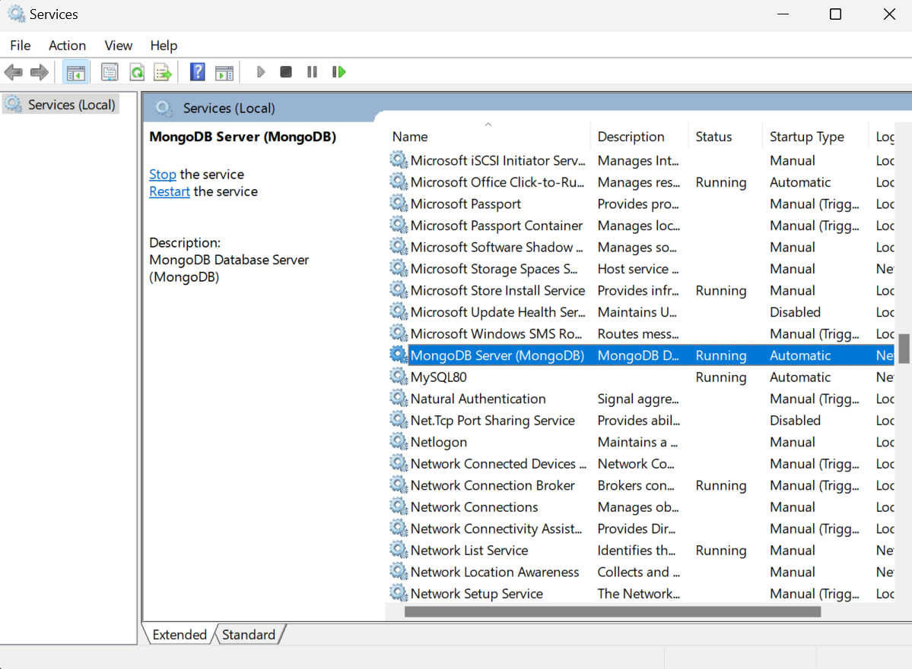

3. After connecting, there are already created databases
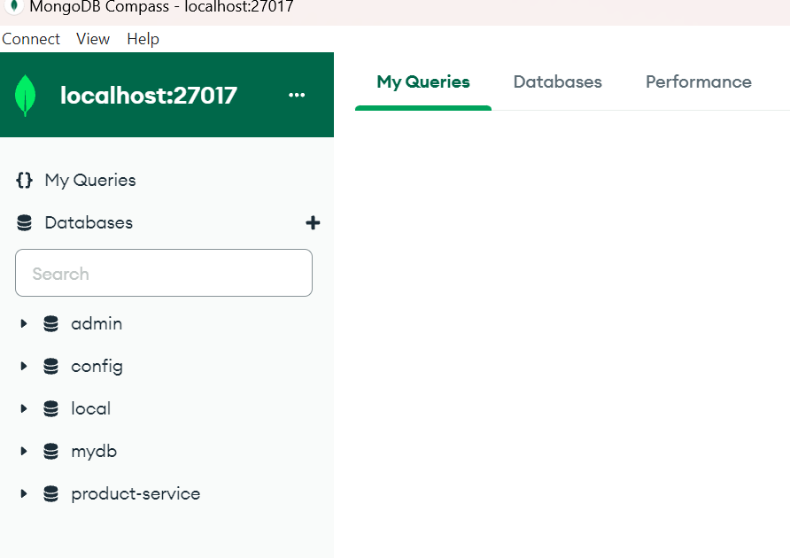

4. Create a database.
    - for creating the first database, MongoDB requires at least 1 document
    - supply the required document name
        - database: bookstore
        - collection: books
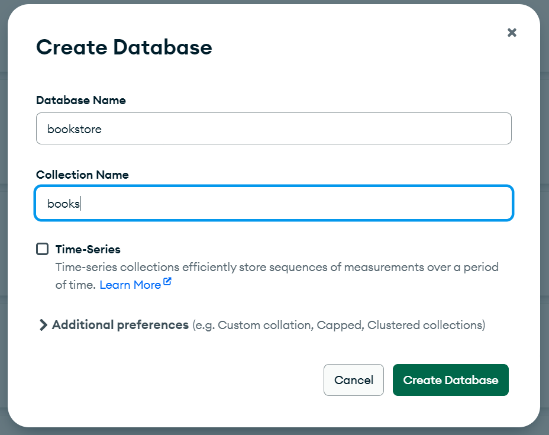

5. Inserting a new Document to the Collection
    - when adding a new document to a collection, it will have initially an id
    - you can delete that, but mongoDb will still save an id property
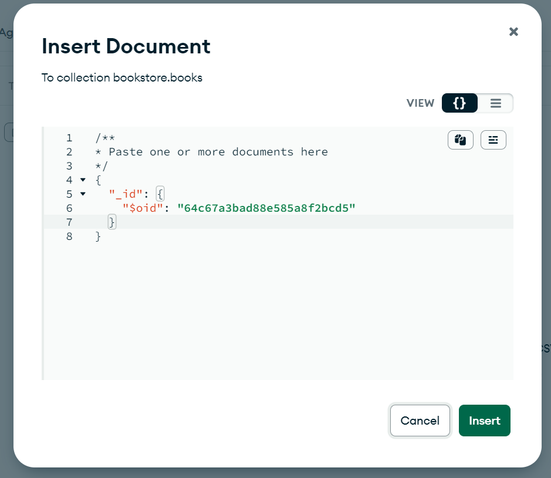

6. Insert the new Document
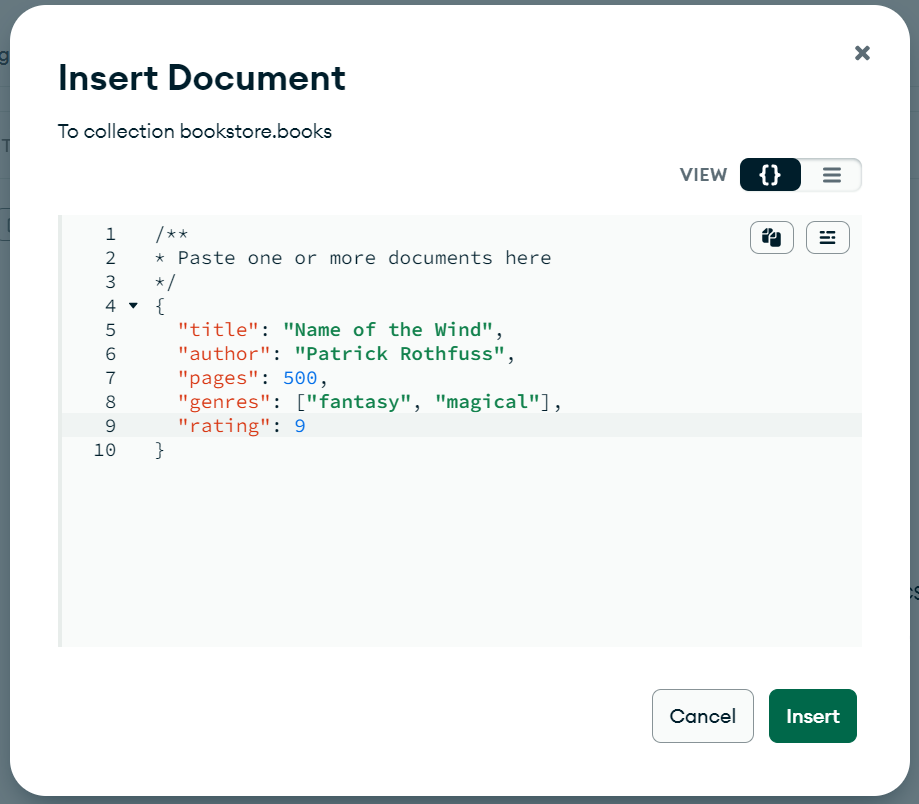


7. Insert Multiple Documents at once
    - wrap the objects in array notation
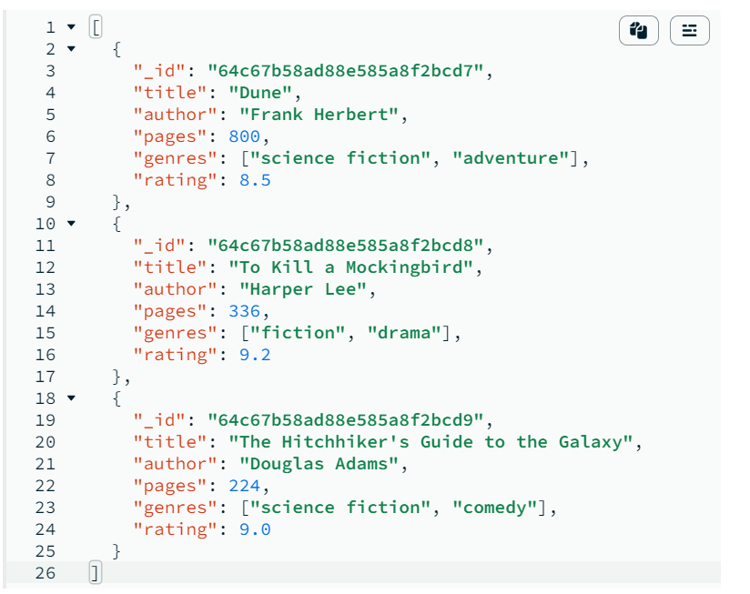

## Using MongoDB Shell

1. `show dbs` 
    - show databases
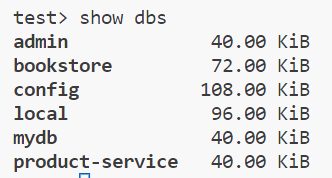

2. `use bookstore`
    - switch to database name bookstore


3. `use mydb`
    - here mydb does not exists
    - but you can switch to a db thats not even existing and add collections to this 

4. `show collections`
    - show all the collections inside the current database
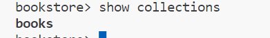

## Adding new Documents

1. Inserting a document to a collection

```mongodb
use bookstore \ 
db.books.insertOne({title: "The color of Magic", author: "Terry", pages: 300, rating: 7, genres: ["fantasy", "magic"]})
```

```json
{
  acknowledged: true,
  insertedId: ObjectId("64c67fc0eeb512142f45253f")
}
```
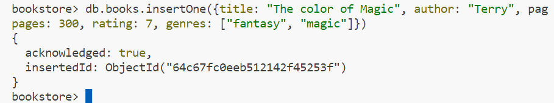

2. Inserting a document to a non existing collection
    - in this example, `authors` does not exist
    - this will still insert and will create a document

```mongodb
db.authors.insertOne({ name: "Brandon Sanderson", age: 60 })
```

3. use insertMany for multiple inserts
```mongodb
db.books.insertMany([{...}, {...}, ...])
```