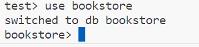

# MONGODB

## Tools

1. MongoDB Shell - CLI
2. MongoDB Compass - GUI

### Using Mongo

```bash
mongosh
```

### Collections and Documents

1. Collections are like tables
2. Collections have Documents


Notes:
    - data are stored similar to JSON
    - BSON - Binary JSON
    - `_id` 
        - every Document has a unique id (internally generated)
        - assigned by MongoDB itself
        - type: `ObjectId`
    - document itself can have a property that is a document or an array of document
        - it is called a nested document

### MongoDB Compass

1. Click Connect in New Connection


2. Go to services and make sure MongoDB Server is up and running
    - MongoDB Compass wont work if MongoDB Server service is down


3. After connecting, there are already created databases


4. Create a database.
    - for creating the first database, MongoDB requires at least 1 document
    - supply the required document name
        - database: bookstore
        - collection: books


5. Inserting a new Document to the Collection
    - when adding a new document to a collection, it will have initially an id
    - you can delete that, but mongoDb will still save an id property


6. Insert the new Document


7. Insert Multiple Documents at once
    - wrap the objects in array notation


## Using MongoDB Shell

1. `show dbs` 
    - show databases


2. `use bookstore`
    - switch to database name bookstore


3. `use mydb`
    - here mydb does not exists
    - but you can switch to a db thats not even existing and add collections to this 

4. `show collections`
    - show all the collections inside the current database


## Adding new Documents

1. Inserting a document to a collection

```mongodb
use bookstore \ 
db.books.insertOne({title: "The color of Magic", author: "Terry", pages: 300, rating: 7, genres: ["fantasy", "magic"]})
```

```json
{
  acknowledged: true,
  insertedId: ObjectId("64c67fc0eeb512142f45253f")
}
```


2. Inserting a document to a non existing collection
    - in this example, `authors` does not exist
    - this will still insert and will create a document

```mongodb
db.authors.insertOne({ name: "Brandon Sanderson", age: 60 })
```

3. use insertMany for multiple inserts

```mongodb
db.books.insertMany([{...}, {...}, ...])
```

## Finding MongoDB Objects
- using find() - this will return the first 20 books

```shell
db.books.find()
```

- it - to iterate 20 more books
```shell
it
```

- using filters, supply an object
    - find all books where author = 'Terry'
```shell
db.books.find({author: 'Terry'})
```

- using filter with multiple predicate
```shell
db.books.find({author: 'Terry', rating: 7})
```

- 2nd parameter of filter, what properties would you want to get
    - Ex: get only title and author
```shell
db.books.find({author: 'Terry'}, { title: 1, author: 1 })
```

- if you want to get all the books, but now filtering the properties that you need, supply the 1st parameter as an empty object
```shell
db.books.find({}, { author: 1, title: 1 })
```

- findOne method
```shell
db.books.findOne({_id:ObjectId("64c67fc0eeb512142f45253f") })
```

## Sorting and Limiting data (using method chaining)

1. `count()`
```shell
db.books.find().count()
db.books.find({author: 'Terry'}).count()
```

2. `limit()`
```shell
db.books.find().limit(3)
db.books.find().limit(4).count()
```

3. `sort()` - `-1` for Descending, `1` for Ascending
```shell
db.books.find().sort({title: -1})
db.books.find().sort({title: 1}).limit(3)
```


## Nested Documents
- a value of a field could also be a nested document
- can improve read performance
- insert a book document with a nested review document
```shell
db.books.insertOne({ title: 'The Way of Kings', author: 'Brandon Sanderson', rating: 9, pages: 400, genres: ['fantasy'], reviews: [{ name: "Yoshi", body: "Great Book!"}, {name:"Ian", body: "so so"}]})
```

## Operations and Complex Queries
- Operators in MongoDB are denoted by `$`
```js
// $gt - greater than
// $lt - less than
// $lte - less than or equal to
// $gte - greater than or equal to
// return all books where rating > 7
db.books.find({rating: { $gt: 7 }})

// get all the books where the rating is 7 or ( rating is 9 or author is Brandon Sanderson
db.books.find({$or: [
    { rating: 7 },
    { rating: 9 , author: 'Brandon Sanderson'}    
]})


// find all books where pages < 300 or pages > 400
db.books.find({
    $or: [
        { pages: { $lt: 300 }},
        { pages: { $gt: 400 }}
    ]
})
```